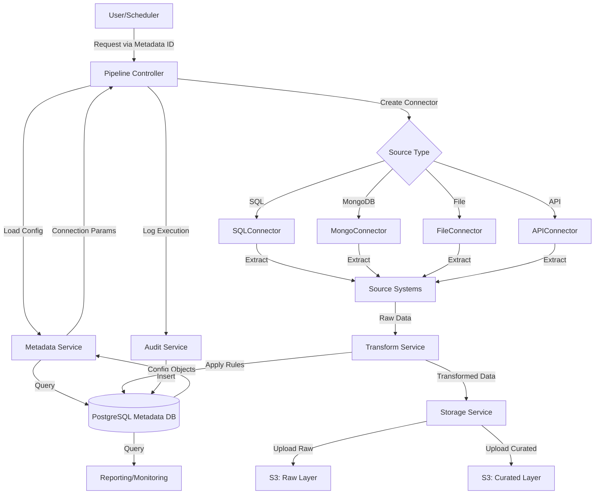

# Data Engineering Framework - Architecture Overview

## Executive Summary
This document provides a comprehensive overview of a metadata-driven, MVC-based data engineering framework designed to safely extract data from multiple source systems (SQL Server, Oracle, MongoDB, flat files, APIs) and load them into AWS S3 with layered storage (Raw, Curated, Archive).

---

## 1. Problem Statement & Solution

### Challenge:
- Multiple heterogeneous data sources
- Direct database connections pose security & operational risks
- Need for centralized data governance
- Scalability and maintainability concerns
- Need for audit and traceability

### Solution:
- **Metadata-Driven Architecture**: All extraction logic defined in metadata tables, not hardcoded
- **MVC Pattern**: Clear separation of concerns (Model, View, Controller)
- **Service Layer Pattern**: Abstraction between data access and business logic
- **PostgreSQL Metadata Store**: Central repository for configuration and operational data
- **S3 Layered Storage**: Raw (ingestion), Curated (processed), Archive (historical)

---

## 2. Core Architecture Principles

### 2.1 MVC Pattern Explained

```
┌─────────────────────────────────────────────────────────┐
│                    CONTROLLER                           │
│  (Pipeline Orchestrator - Entry Point)                 │
│  - Receives extraction requests                         │
│  - Coordinates workflow                                │
│  - Manages execution logic                             │
└────────────────────┬────────────────────────────────────┘
                     │
        ┌────────────┴────────────┐
        │                         │
┌───────▼──────────┐      ┌──────▼────────────┐
│      MODEL       │      │   SERVICE LAYER  │
│                  │      │                   │
│ Data Objects:    │      │ - Metadata Svc   │
│ - Metadata       │      │ - Connector Svc  │
│ - Connection     │      │ - Transform Svc  │
│ - Pipeline       │      │ - Storage Svc    │
│ - Execution      │      │ - Audit Svc      │
│                  │      │                   │
└────────┬─────────┘      └──────┬────────────┘
         │                       │
         └───────────┬───────────┘
                     │
        ┌────────────▼────────────┐
        │                         │
        │   DATA ACCESS LAYER     │
        │                         │
        │ - PostgreSQL (Metadata) │
        │ - Source Systems        │
        │ - S3 Storage            │
        │                         │
        └─────────────────────────┘
```

### 2.2 Layered Architecture

#### Layer 1: View/Controller Layer
- **Pipeline Controller**: Orchestrates entire extraction workflow
- **Request Handler**: Accepts extraction requests with metadata reference
- **Execution Manager**: Manages job lifecycle

#### Layer 2: Service Layer (Business Logic)
- **Metadata Service**: CRUD operations on metadata
- **Connector Service**: Factory pattern for source connection management
- **Extraction Service**: Orchestrates data extraction
- **Transform Service**: Data transformation logic
- **Storage Service**: S3 upload and management
- **Audit Service**: Logging and compliance tracking

#### Layer 3: Model Layer (Data Objects)
- **Metadata Models**: Configuration schemas
- **Connection Models**: Connection parameters
- **Pipeline Models**: Extraction pipeline definition
- **Execution Models**: Runtime execution tracking

#### Layer 4: Data Access Layer
- **PostgreSQL Repository**: Metadata access
- **Connector Factory**: Database-specific implementations
- **S3 Client**: Cloud storage operations

---

## 3. Metadata-Driven Design Pattern

### 3.1 Core Concept
Instead of hardcoded extraction logic, all parameters are stored in PostgreSQL metadata tables:

```
┌──────────────────────────────────────────────────────────────┐
│                    METADATA TABLES                           │
├──────────────────────────────────────────────────────────────┤
│ • metadata_sources      (source system definitions)          │
│ • metadata_connections  (connection parameters)              │
│ • metadata_pipelines    (extraction configurations)          │
│ • metadata_fields       (field mappings and transformations) │
│ • metadata_validations  (data quality rules)                 │
│ • execution_log         (audit trail)                        │
│ • execution_details     (detailed job metrics)               │
│ • error_log             (error tracking)                     │
└──────────────────────────────────────────────────────────────┘
```

### 3.2 How It Works

1. **Request comes in** → Pipeline Controller
2. **Controller loads metadata** → Metadata Service queries PostgreSQL
3. **Service instantiates connectors** → Connector Factory creates appropriate connection
4. **Data extracted** → No direct hardcoded logic, all from metadata
5. **Data transformed** → Per metadata transformation rules
6. **Data loaded** → To appropriate S3 layer based on metadata
7. **Audit recorded** → Execution log captures everything

---

## 4. Source System Integration

### 4.1 Supported Sources

#### Relational Databases
- **SQL Server**: ODBC/PyODBC
- **Oracle**: cx_Oracle
- **PostgreSQL**: psycopg2

#### NoSQL Databases
- **MongoDB**: pymongo

#### File-Based
- **CSV, Excel, JSON**: pandas, openpyxl
- **Parquet, Avro**: pyarrow

#### APIs
- **REST APIs**: requests, retry mechanism
- **SOAP**: zeep

### 4.2 Connector Pattern

Each source type has a dedicated connector implementing a common interface:

```python
class IConnector:
    def connect(self) -> Connection
    def execute_query(self, query: str) -> DataFrame
    def validate_connection(self) -> bool
    def close(self) -> None
```

---

## 5. S3 Layered Storage Structure

### 5.1 Three-Layer Architecture

```
s3://data-lake-bucket/
├── raw/                 (Layer 1 - Raw Ingestion)
│   ├── source_system_1/
│   │   ├── table_1/
│   │   │   ├── 2024-01-15_001.parquet
│   │   │   └── 2024-01-15_002.parquet
│   │   └── table_2/
│   └── source_system_2/
│
├── curated/             (Layer 2 - Processed/Cleaned)
│   ├── domain_1/
│   │   ├── dataset_1/
│   │   └── dataset_2/
│   └── domain_2/
│
└── archive/             (Layer 3 - Historical/Cold Storage)
    ├── 2024-q1/
    ├── 2024-q2/
    └── 2024-q3/
```

### 5.2 Layer Definitions

| Layer | Purpose | Format | Retention | Access Pattern |
|-------|---------|--------|-----------|-----------------|
| **Raw** | Exact copy from source | Parquet | 90 days | On-demand |
| **Curated** | Cleaned, transformed | Parquet | 2 years | Frequent |
| **Archive** | Historical backup | Compressed Parquet | 7+ years | Rare |

---

## 6. Data Flow Diagram



---

## 7. MVC Implementation Details

### 7.1 Controller (Orchestration)
- Entry point for all extraction jobs
- Coordinates between different services
- Manages error handling and retries
- Triggers transformations and validations

### 7.2 Model (Data Representation)
- Dataclasses for type safety
- Inheritance hierarchy for reusability
- Validation at model level

### 7.3 Service Layer (Business Logic)
- No direct database access in services
- All DB operations through repositories
- Service methods are transaction-aware
- Implements factory pattern for connectors

### 7.4 Data Access Layer (Isolation)
- Repository pattern for data access
- Connection pooling for efficiency
- Query parameterization for security
- Logging of all data access operations

---

## 8. Security Features

### 8.1 Database Protection
- ✓ No direct connection strings in code
- ✓ Parameterized queries (SQL injection prevention)
- ✓ Connection pooling with timeout
- ✓ Encrypted credential storage in PostgreSQL

### 8.2 Data Protection
- ✓ Data classification at metadata level
- ✓ Encryption in transit (TLS)
- ✓ Encryption at rest (S3 KMS)
- ✓ Field-level masking for PII

### 8.3 Audit & Compliance
- ✓ Complete execution audit trail
- ✓ Data lineage tracking
- ✓ Change management logs
- ✓ Access logs with timestamps

---

## 9. Error Handling & Resilience

### 9.1 Retry Strategy
```
Initial Attempt
    ↓
Failure? → Exponential Backoff (1s, 2s, 4s, 8s, 16s)
    ↓ (Success) → Continue
    ↓ (Failed after max retries)
Circuit Breaker
    ↓
Log Error & Alert
    ↓
Move to Dead Letter Queue
```

### 9.2 Validation Layers
1. **Metadata Validation**: Validate configuration at load time
2. **Connection Validation**: Verify connectivity before extraction
3. **Data Validation**: Apply quality rules from metadata
4. **Schema Validation**: Ensure data matches expected schema

---

## 10. Extensibility & Maintenance

### 10.1 Adding New Source Types
1. Create new Connector class inheriting from IConnector
2. Implement connection, query execution, validation methods
3. Register in ConnectorFactory
4. Add configuration metadata entries
5. Test and deploy

### 10.2 Modifying Extraction Logic
- No code changes required
- Update metadata tables only
- Changes take effect on next execution
- Audit trail maintains history

### 10.3 Adding New Transformations
- Define in metadata_transformations table
- Can chain multiple transformations
- Support for custom Python functions
- SQL-based transformations for efficiency

---

## 11. Key Benefits of This Architecture

| Benefit | How Achieved |
|---------|-------------|
| **Security** | No direct DB access, abstraction layers |
| **Maintainability** | Metadata-driven, centralized config |
| **Scalability** | Service-based, can horizontally scale |
| **Auditability** | Complete execution tracking |
| **Flexibility** | Easy to add new sources/transformations |
| **Governance** | Centralized metadata management |
| **Traceability** | Data lineage from source to target |
| **Reliability** | Retry logic, error handling, validation |

---

## 12. Next Steps

1. **Database Setup**: Create PostgreSQL metadata schema
2. **Framework Implementation**: Build core services and models
3. **Connector Development**: Implement source-specific connectors
4. **Testing**: Unit, integration, and end-to-end tests
5. **Deployment**: Containerize and deploy to production
6. **Monitoring**: Set up alerting and metrics

---

**Document Version**: 1.0  
**Last Updated**: 2024  
**Status**: Active
