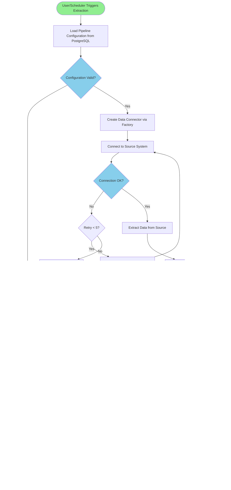
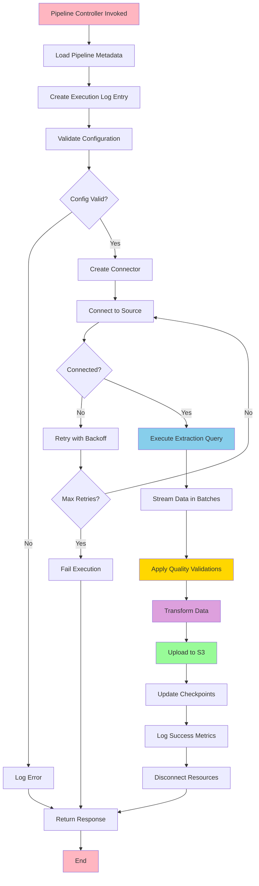
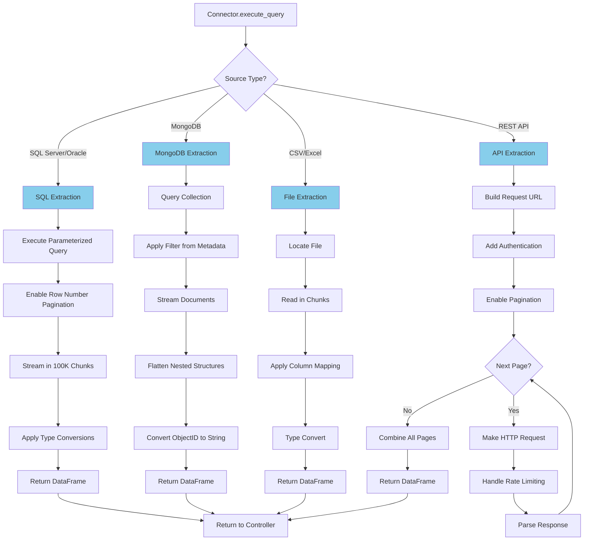
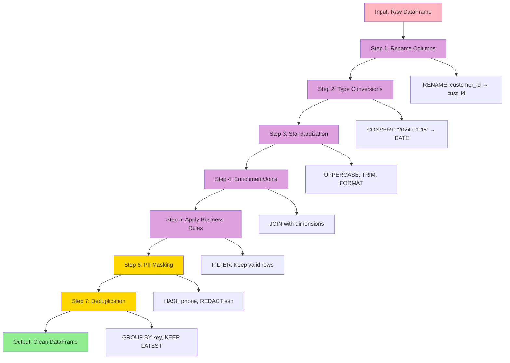
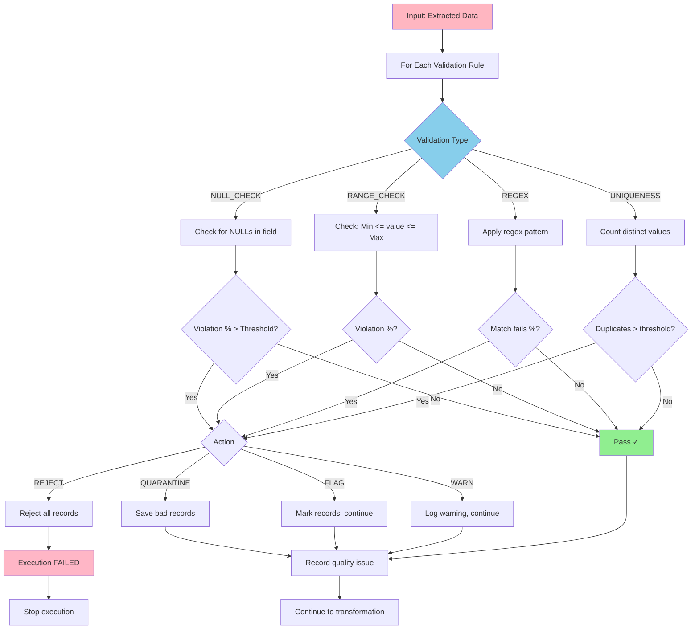
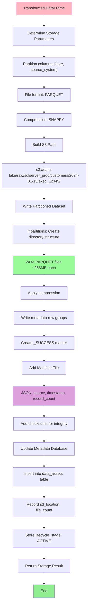
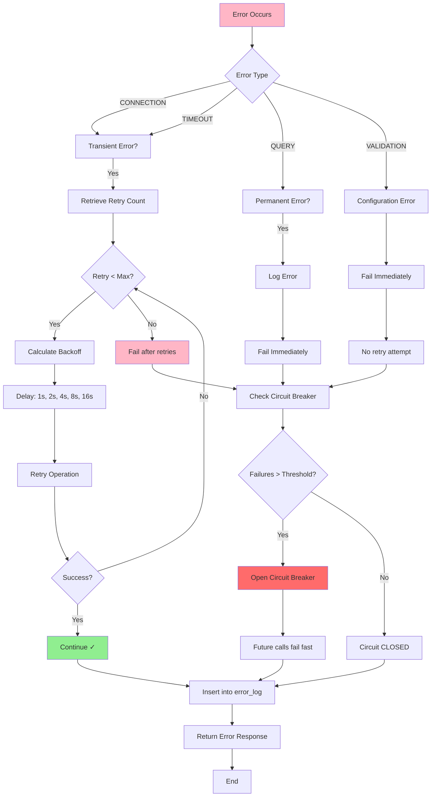
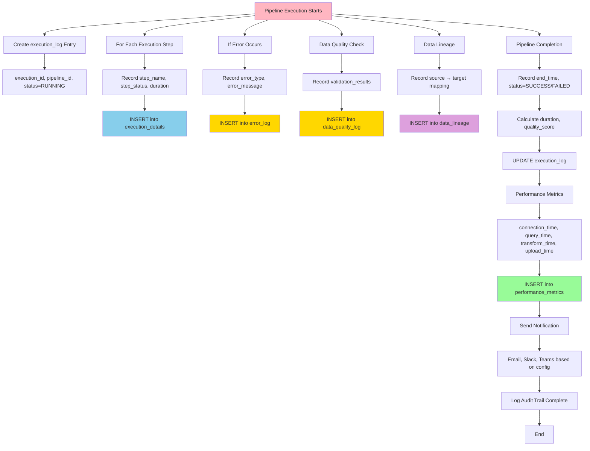

# Framework Flowchart Documentation

## 1. HIGH-LEVEL EXECUTION FLOW



---

## 2. DETAILED PIPELINE CONTROLLER FLOW



---

## 3. DATA EXTRACTION FLOW (By Source Type)



---

## 4. DATA TRANSFORMATION FLOW



---

## 5. DATA QUALITY VALIDATION FLOW



---

## 6. S3 STORAGE FLOW



---

## 7. ERROR HANDLING & RETRY FLOW



---

## 8. AUDIT LOGGING FLOW



---

## 9. COMPLETE END-TO-END FLOW (Timeline)

```
Timeline: SQL Server Extraction Pipeline
═════════════════════════════════════════

T+00s  ├─ Request arrives: extract_pipeline(pipeline_id=1)
       │
T+01s  ├─ Load metadata from PostgreSQL
       │  └─ Pipeline configuration
       │  └─ Connection details
       │  └─ Field mappings
       │  └─ Transformations
       │  └─ Validations
       │
T+02s  ├─ Create execution log entry
       │  └─ execution_id=12345
       │  └─ status=RUNNING
       │
T+03s  ├─ Validate configuration
       │  └─ Check SQL syntax
       │  └─ Check S3 path format
       │  └─ Check retention policy
       │  └─ Result: VALID ✓
       │
T+05s  ├─ Create SQL Server connector
       │  └─ Retrieve encrypted credentials
       │  └─ Initialize PyODBC
       │  └─ Connector ready
       │
T+07s  ├─ Connect to SQL Server
       │  ├─ Connection attempt #1: SUCCESS
       │  └─ Connection pool size: 10
       │
T+08s  ├─ Validate connection
       │  ├─ Execute: SELECT 1
       │  └─ Result: Connection OK ✓
       │
T+10s  ├─ Execute extraction query
       │  ├─ Query: SELECT * FROM customers WHERE modified_date > '2024-01-14'
       │  ├─ Enable pagination: 100K rows per batch
       │  └─ Batch 1/100: Processing...
       │
T+04m30s ├─ Extraction complete
        │  ├─ Total records: 10,000,000
        │  ├─ Batches processed: 100
        │  └─ Duration: 270 seconds
        │
T+04m45s ├─ Data quality validation
        │  ├─ Validation 1 (NULL checks): PASS
        │  ├─ Validation 2 (Email regex): PASS (5 quarantined)
        │  ├─ Validation 3 (Uniqueness): PASS
        │  ├─ Overall quality score: 99.95%
        │  └─ Action: CONTINUE ✓
        │
T+05m15s ├─ Data transformations
        │  ├─ Standardize dates: 30s
        │  ├─ Standardize names: 45s
        │  ├─ Mask PII (phone, ssn): 20s
        │  ├─ Join with dimensions: 15s
        │  ├─ Deduplication: 10s
        │  └─ Total: 120 seconds
        │
T+06m35s ├─ S3 upload
        │  ├─ Path: s3://data-lake/raw/sqlserver_prod/customers/2024-01-15/exec_12345/
        │  ├─ Files: 40 Parquet files
        │  ├─ Compression: Snappy
        │  ├─ Size: ~10GB
        │  └─ Duration: 80 seconds
        │
T+06m55s ├─ Update metadata
        │  ├─ data_assets table: INSERT
        │  ├─ checkpoint table: UPDATE (for next incremental)
        │  └─ Duration: 20 seconds
        │
T+07m05s ├─ Audit logging
        │  ├─ execution_log: status=SUCCESS
        │  ├─ execution_details: All steps recorded
        │  ├─ performance_metrics: Recorded
        │  ├─ data_lineage: Recorded
        │  └─ Duration: 10 seconds
        │
T+07m10s ├─ Send notification
        │  ├─ Success notification: Sent to data-team@company.com
        │  └─ Details: 10M records extracted in 9m 50s
        │
T+07m15s └─ EXECUTION COMPLETE ✓
          └─ Return ExecutionResponse
             ├─ execution_id: 12345
             ├─ status: SUCCESS
             ├─ total_records: 10,000,000
             ├─ quality_score: 99.95%
             └─ s3_location: s3://data-lake/raw/...
```

---

## 10. COMPARISON: Direct Access vs Framework

```
DIRECT DATABASE ACCESS:
┌──────────────┐
│ Application  │
└──────┬───────┘
       │ SQL Query
       │ Direct Connection
       │ No Abstraction
       ▼
    [DATABASE] ← VULNERABLE!
    - Multiple concurrent connections
    - No audit trail
    - SQL injection risk
    - Connection strings in code
    - Difficult to scale


FRAMEWORK-BASED ACCESS:
┌──────────────────────────┐
│ User/Scheduler Request   │
└──────────┬───────────────┘
           │
    ┌──────▼──────────┐
    │ Controller      │
    │ (Gate Keeper)   │
    └──────┬──────────┘
           │
    ┌──────▼──────────────────────────┐
    │ Service Layer (Authorization)   │
    │ • Load metadata                 │
    │ • Verify permissions            │
    │ • Load credentials (encrypted)  │
    │ • Create connector              │
    └──────┬───────────────────────────┘
           │
    ┌──────▼──────────────────────┐
    │ Single Connector            │
    │ • Connection pooling        │
    │ • Parameterized queries     │
    │ • Automatic retry           │
    │ • Resource cleanup          │
    └──────┬────────────────────┬─────┐
           │                    │     │
     ┌─────▼──┐        ┌──────▼──┐  ┌▼──────┐
     │[SQL]   │        │[ORACLE] │  │[MONGO]│
     └────────┘        └─────────┘  └───────┘
           │                    │     │
           └──────────────┬─────┴─────┘
                          │
                  ┌───────▼────────────┐
                  │ Audit Service      │
                  │ • Log all access   │
                  │ • Record lineage   │
                  │ • Track metrics    │
                  └────────────────────┘

PROTECTED!
- Single point of control
- Complete audit trail
- No SQL injection possible
- Credentials never exposed
- Easy to scale and monitor
```

---

## 11. KEY DECISION POINTS

```
Pipeline Execution Decision Tree

START
  │
  ├─ Configuration Valid?
  │  ├─ NO  → ERROR: Return config error
  │  └─ YES → Continue
  │
  ├─ Can Connect to Source?
  │  ├─ NO (transient)   → RETRY (exponential backoff)
  │  ├─ NO (persistent)  → ERROR: Return connection error
  │  └─ YES              → Continue
  │
  ├─ Data Quality OK?
  │  ├─ NO (REJECT)      → ERROR: Reject entire dataset
  │  ├─ NO (QUARANTINE)  → Continue (bad records isolated)
  │  ├─ NO (FLAG)        → Continue (records marked)
  │  └─ YES              → Continue
  │
  ├─ Transformation Successful?
  │  ├─ NO  → ERROR: Log and fail
  │  └─ YES → Continue
  │
  ├─ S3 Upload Successful?
  │  ├─ NO  → ERROR: Retry, then fail
  │  └─ YES → Continue
  │
  ├─ Metadata Update Successful?
  │  ├─ NO  → WARNING: Data loaded but metadata not updated
  │  └─ YES → Continue
  │
  └─ SUCCESS: Execution complete
     └─ Return ExecutionResponse with metrics
```

---

**Flowchart Version**: 1.0  
**Status**: Production Ready  
**Updated**: January 2024
