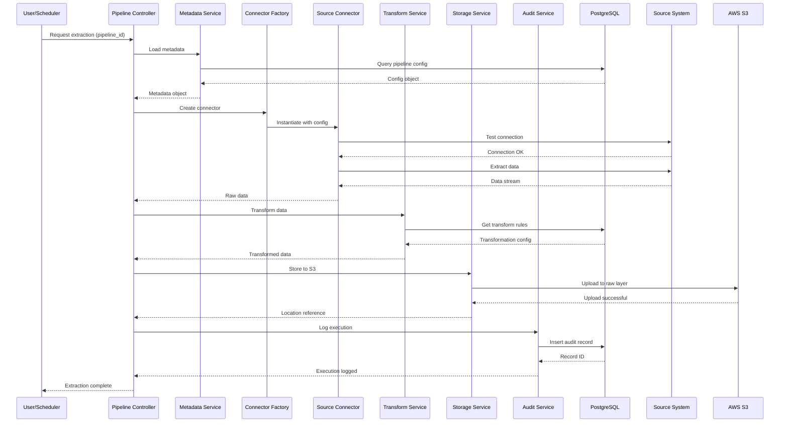

# Complete Workflow Guide - Data Engineering Framework

## Table of Contents
1. End-to-End Workflow
2. Component Interaction Flows
3. Execution Scenarios
4. Error Handling Workflows
5. Implementation Checklist

---

## 1. END-TO-END WORKFLOW

### 1.1 Standard Extraction Pipeline

```
STEP 1: INITIATE REQUEST
├─ User/Scheduler triggers extraction
├─ Provides: Pipeline ID or metadata reference
└─ Output: Extraction job ID

STEP 2: LOAD CONFIGURATION
├─ Pipeline Controller queries Metadata Service
├─ Metadata Service retrieves from PostgreSQL:
│  ├─ Pipeline configuration
│  ├─ Source connection details
│  ├─ Field mappings
│  ├─ Transformation rules
│  └─ Validation rules
└─ Output: Complete extraction blueprint

STEP 3: VALIDATE CONFIGURATION
├─ Metadata Validator checks:
│  ├─ All required fields present
│  ├─ Connection parameters valid
│  ├─ SQL queries syntactically correct
│  ├─ Output path format valid
│  └─ Retention policies applicable
└─ Output: Validation report

STEP 4: ESTABLISH CONNECTION
├─ Connector Factory creates connector based on source type
├─ Connector instantiates connection with:
│  ├─ Host/endpoint
│  ├─ Port
│  ├─ Database name
│  ├─ Credentials (from secure storage)
│  └─ Connection options (timeout, pool size, etc.)
├─ Test connection validity
└─ Output: Active connection object

STEP 5: EXTRACT DATA
├─ If Query-based (SQL):
│  ├─ Execute parameterized query
│  ├─ Apply pagination for large datasets
│  ├─ Stream data to prevent memory overflow
│  └─ Output: Data stream
├─ If File-based:
│  ├─ Read from location
│  ├─ Stream in chunks
│  └─ Output: Data stream
└─ If API-based:
   ├─ Make paginated requests
   ├─ Handle rate limiting
   └─ Output: Data stream

STEP 6: VALIDATE DATA QUALITY
├─ Data Quality Service applies rules from metadata:
│  ├─ Null checks
│  ├─ Data type validation
│  ├─ Range validation
│  ├─ Uniqueness constraints
│  ├─ Referential integrity
│  └─ Business rule validation
├─ Log quality metrics
└─ Output: Quality report

STEP 7: TRANSFORM DATA
├─ Apply transformations in sequence:
│  ├─ Data type conversions
│  ├─ Standardization (formatting)
│  ├─ Enrichment (joins with reference data)
│  ├─ Aggregation (if needed)
│  ├─ Masking (PII protection)
│  └─ Deduplication
└─ Output: Transformed DataFrame

STEP 8: STORE IN RAW LAYER
├─ Storage Service prepares data:
│  ├─ Partition by: [source_system]/[table_name]/[load_date]/[batch_id]
│  ├─ Format: Parquet (for efficiency and compression)
│  ├─ Compression: snappy
│  └─ Metadata: Add source lineage, extraction timestamp
├─ Upload to S3: s3://data-lake/raw/[source]/[table]/[date]/
└─ Output: Raw data location reference

STEP 9: CURATE DATA (if applicable)
├─ Apply curated layer transformations:
│  ├─ Join with dimensions
│  ├─ Apply business rules
│  ├─ Create aggregates
│  ├─ Denormalize for analytics
│  └─ Add calculated fields
├─ Store in S3: s3://data-lake/curated/[domain]/[dataset]/
└─ Output: Curated data location reference

STEP 10: ARCHIVE HISTORICAL DATA (if applicable)
├─ Archive Service processes:
│  ├─ Identify data older than retention period
│  ├─ Compress to reduce storage costs
│  ├─ Move to archive layer (S3 Glacier)
│  └─ Update metadata
└─ Output: Archive completion report

STEP 11: LOG EXECUTION
├─ Audit Service records:
│  ├─ Execution ID
│  ├─ Start/End timestamps
│  ├─ Source/Target details
│  ├─ Records processed
│  ├─ Records failed
│  ├─ Execution status
│  ├─ Data lineage
│  └─ Execution metrics
└─ Output: Audit log entry

STEP 12: NOTIFY & COMPLETE
├─ Notification Service:
│  ├─ Success → Send success alert
│  ├─ Failure → Send failure alert with details
│  └─ Include execution summary
└─ Output: Job completion status
```

### 1.2 Detailed Component Interaction Diagram



---

## 2. COMPONENT INTERACTION FLOWS

### 2.1 Metadata Service Flow

```
Request for Pipeline Configuration
        ↓
Validate Pipeline ID
        ↓
Query PostgreSQL (metadata_pipelines table)
        ↓
Load Related Metadata:
├─ Source system config
├─ Connection parameters
├─ Field mappings
├─ Transformation rules
├─ Validation rules
└─ Partition rules
        ↓
Cache in-memory (with TTL)
        ↓
Return PipelineConfiguration Object
```

### 2.2 Connector Service Flow

```
ConnectorFactory.create(source_type, config)
        ↓
Match source_type:
├─ "SQLSERVER" → Create SQLServerConnector
├─ "ORACLE" → Create OracleConnector
├─ "MONGODB" → Create MongoConnector
├─ "FILE_CSV" → Create CSVConnector
├─ "FILE_EXCEL" → Create ExcelConnector
├─ "REST_API" → Create APIConnector
└─ Other → Raise UnknownSourceError
        ↓
Initialize Connector with config
        ↓
Validate connection parameters
        ↓
Return Connector instance ready for use
```

### 2.3 Data Extraction Flow

```
FOR RELATIONAL DATABASES (SQL Server, Oracle, PostgreSQL):

Execute Query
        ↓
Enable Pagination (if result set large):
├─ ROW_NUMBER() OVER (ORDER BY pk)
├─ Chunk size: configurable (default 100,000)
└─ Process in batches
        ↓
Stream data to DataFrame in chunks
        ↓
Apply column type conversions per metadata
        ↓
Return DataFrame


FOR MONGODB:

Query Collection
        ↓
Apply filter from metadata
        ↓
Use projection for selected fields only
        ↓
Stream documents to DataFrame
        ↓
Expand nested structures
        ↓
Return DataFrame


FOR FILE SOURCES (CSV, Excel, JSON):

Locate file:
├─ Local path
├─ Network path (UNC)
├─ S3 path
└─ HDFS path
        ↓
Read in chunks (for large files)
        ↓
Apply column name mapping from metadata
        ↓
Type convert columns
        ↓
Return DataFrame


FOR REST APIs:

Build Request URL with:
├─ Endpoint from metadata
├─ Query parameters
├─ Authentication headers
└─ Pagination parameters
        ↓
FOR EACH PAGE:
├─ Make HTTP request
├─ Handle rate limiting (backoff)
├─ Parse response (JSON/XML)
├─ Flatten nested structures
└─ Append to DataFrame
        ↓
Return combined DataFrame
```

### 2.4 Data Transformation Flow

```
Input: Raw DataFrame
        ↓
STEP 1: Structural Transformations
├─ Rename columns (per metadata)
├─ Reorder columns
├─ Add technical columns (load_date, source_id, etc.)
└─ Drop unnecessary columns
        ↓
STEP 2: Type Conversions
├─ Parse dates per format in metadata
├─ Convert strings to numeric types
├─ Convert numbers to strings where needed
└─ Handle type conversion errors gracefully
        ↓
STEP 3: Standardization
├─ Trim whitespace
├─ Convert to uppercase/lowercase per config
├─ Replace special characters
├─ Normalize address formats
└─ Standardize phone/email formats
        ↓
STEP 4: Enrichment (Joins)
├─ Load reference data from cache or DB
├─ Left join with dimension tables
├─ Resolve foreign keys
└─ Add business descriptions
        ↓
STEP 5: Validation & Filtering
├─ Apply business rules
├─ Filter invalid rows
├─ Flag data quality issues
└─ Log rejected records
        ↓
STEP 6: PII Masking (if applicable)
├─ Identify PII columns from metadata
├─ Apply masking functions:
│  ├─ Hash
│  ├─ Truncation
│  ├─ Substitution
│  └─ Redaction
└─ Maintain audit trail
        ↓
STEP 7: Deduplication (if applicable)
├─ Identify duplicate key columns
├─ Keep first/last/max version
├─ Record duplicate count
└─ Log deduplication details
        ↓
Output: Cleaned, enriched, validated DataFrame
```

### 2.5 Storage Service Flow

```
Input: Transformed DataFrame
        ↓
DETERMINE STORAGE PARAMETERS:
├─ Partition columns
├─ Storage format (Parquet/ORC/CSV)
├─ Compression algorithm
├─ Data types for columns
└─ Retention policy
        ↓
BUILD S3 PATH:
S3://data-lake/[layer]/[source_system]/[table_name]/[load_date]/[batch_id]

Where:
├─ [layer]: raw | curated | archive
├─ [source_system]: sqlserver_prod | oracle_hr | mongodb_crm
├─ [table_name]: customers | orders | products
├─ [load_date]: YYYY-MM-DD
└─ [batch_id]: UUID or sequential
        ↓
CREATE PARTITIONED DATASET:
├─ If partition columns specified:
│  └─ Create directory structure by partition
├─ Write Parquet files:
│  ├─ Each partition file ~256MB
│  ├─ Apply compression (snappy)
│  └─ Write metadata (row groups, statistics)
└─ Create _SUCCESS marker file
        ↓
ADD METADATA:
├─ Write manifest file with:
│  ├─ Source: [system and table]
│  ├─ extraction_timestamp: UTC timestamp
│  ├─ record_count: total records
│  ├─ file_count: number of files
│  ├─ data_version: version number
│  └─ checksum: for data integrity
└─ Store in S3 metadata
        ↓
UPDATE METADATA DATABASE:
├─ Insert into data_assets table:
│  ├─ asset_id
│  ├─ source_system_id
│  ├─ source_table_name
│  ├─ s3_location
│  ├─ layer: raw/curated/archive
│  ├─ record_count
│  ├─ last_modified
│  ├─ created_by: execution_id
│  └─ lifecycle_stage
        ↓
OUTPUT: Storage reference
├─ S3 location
├─ Record count
├─ File count
├─ Manifest location
└─ Metadata ID
```

---

## 3. EXECUTION SCENARIOS

### 3.1 Scenario 1: Full Daily Load

**When**: Every morning 2 AM  
**Source**: SQL Server - Orders table (10M records)  
**Target**: S3 raw layer

```
2:00:00 → START
2:00:15 → Load metadata (0.5M records, 15s)
2:00:30 → Connect to SQL Server (30s)
2:00:35 → Execute paginated query (4M30s)
│          - 100K records per page
│          - ~45 pages total
2:05:05 → Apply transformations (1m 30s)
2:06:35 → Validate data (45s)
2:07:20 → Upload to S3 (1m 20s)
2:08:40 → Update metadata (20s)
2:09:00 → COMPLETE
│
Total Duration: ~9 minutes
Success Rate: Expected 99.9%
```

### 3.2 Scenario 2: Incremental Load with CDC

**When**: Every 30 minutes  
**Source**: Oracle - CDC Change Logs  
**Target**: S3 curated layer

```
Metadata specifies:
├─ extraction_type: INCREMENTAL
├─ cdc_table: CUSTOMER_LOG$
├─ last_scn: stored in metadata
└─ partition_key: CUSTOMER_ID

Execution:
├─ Query: WHERE SCN > {last_scn}
├─ Extract only changed records
├─ Apply transformations
├─ Store in curated layer
├─ Update last_scn in metadata
└─ Duration: ~2 minutes (for typical 100K changes)
```

### 3.3 Scenario 3: API Data Pull

**When**: Hourly  
**Source**: SalesForce REST API  
**Target**: S3 raw layer

```
Metadata specifies:
├─ endpoint: /services/data/v58.0/sobjects/Account
├─ page_size: 10,000
├─ rate_limit: 100 req/min
├─ retry_strategy: exponential backoff
└─ timeout: 30s per request

Execution:
├─ Request page 1 (max 10K records)
├─ Parse JSON response
├─ Handle rate limiting (delay between pages)
├─ Flatten nested JSON objects
├─ Continue pagination until complete
├─ Deduplicate records
├─ Store to S3
└─ Duration: ~5-10 minutes (typical 50K records)
```

### 3.4 Scenario 4: File Ingestion from SFTP

**When**: On-demand or scheduled  
**Source**: SFTP - Daily vendor feed (CSV)  
**Target**: S3 curated layer

```
Metadata specifies:
├─ source_type: SFTP
├─ host: sftp.vendor.com
├─ path: /outbound/daily_*.csv
├─ encoding: UTF-8
├─ delimiter: comma
└─ schema: predefined field list

Execution:
├─ Connect to SFTP
├─ List matching files
├─ Download latest file
├─ Parse CSV with proper encoding
├─ Apply transformation rules
├─ Validate schema compliance
├─ Store to S3 curated layer
└─ Archive source file
```

---

## 4. ERROR HANDLING WORKFLOWS

### 4.1 Connection Failure

```
ATTEMPT 1 (Immediate)
        ↓
FAIL → Record error details
        ↓
RETRY LOGIC APPLIES:
├─ Wait: 1 second
│
ATTEMPT 2
├─ Wait: 2 seconds
│
ATTEMPT 3
├─ Wait: 4 seconds
│
ATTEMPT 4
├─ Wait: 8 seconds
│
ATTEMPT 5
        ↓
FAIL AFTER MAX RETRIES
        ↓
ACTIONS:
├─ Log to error_log table (detailed error message)
├─ Insert into execution_log (FAILED status)
├─ Send alert notification to ops team
├─ Create incident (if configured)
└─ Move job to dead-letter queue

CIRCUIT BREAKER:
├─ If 5 consecutive failures
├─ Mark source system as DOWN
├─ Skip subsequent attempts (for 1 hour)
├─ Resume with health check after cooldown
```

### 4.2 Data Quality Failure

```
Data validation fails:
├─ Example: 5000 NULLs in required field (10% of data)
        ↓
THRESHOLD CHECK:
├─ If null_percentage > allowed_threshold (configured: 5%)
├─ Trigger quality exception
        ↓
ACTION BASED ON SEVERITY:

HIGH SEVERITY (null% > 10%):
├─ REJECT entire dataset
├─ Log detailed error analysis:
│  ├─ Column name: CUSTOMER_ID
│  ├─ Null count: 5,000
│  ├─ Total records: 100,000
│  ├─ Percentage: 5%
│  ├─ Root cause: Unknown (investigate)
│  └─ Recommendation: Contact source team
├─ Do NOT load to S3
├─ Send alert with details
├─ Create support ticket
└─ Retry next scheduled window

MEDIUM SEVERITY (5% < null% <= 10%):
├─ Flag records with issues
├─ Store separately in S3:
│  └─ s3://data-lake/quality-quarantine/...
├─ Continue with remaining records
├─ Send warning notification
└─ Schedule manual review

LOW SEVERITY (null% <= 5%):
├─ Filter problematic records
├─ Continue processing
├─ Log in data_quality_log
└─ Send info notification
```

### 4.3 Extraction Failure - Partial

```
Scenario: Extraction interrupted after 50M records (of 100M total)

DETECTION:
├─ Connection timeout after 15 min
├─ Last successful record: record_id = 50,000,000
        ↓
RECOVERY OPTIONS:

Option 1: RESUME FROM CHECKPOINT
├─ Metadata stores: last_successful_offset = 50,000,000
├─ Next execution queries:
│  └─ WHERE record_id > 50,000,000
├─ Continues extraction
├─ Deduplicates against already-loaded records
├─ No re-processing of first 50M
├─ Duration: ~50% of original

Option 2: FULL RETRY
├─ Reset checkpoint
├─ Re-extract all 100M (fallback)
├─ Performance hit: full duration

Option 3: MANUAL INTERVENTION
├─ Alert ops team with details
├─ Allow manual assessment
├─ Provide recovery commands
└─ Document resolution

AUDIT TRAIL:
├─ Partial load recorded
├─ Attempted retry recorded
├─ Final status recorded
├─ Manual intervention (if any) recorded
```

---

## 5. IMPLEMENTATION CHECKLIST

### Phase 1: Foundation Setup (Week 1-2)

- [ ] PostgreSQL cluster provisioned
- [ ] Database created: `metadata_management`
- [ ] All metadata tables created
- [ ] AWS S3 buckets created (raw, curated, archive layers)
- [ ] S3 bucket policies configured
- [ ] IAM roles and policies created
- [ ] Encryption keys configured (KMS)
- [ ] VPC and networking configured

### Phase 2: Framework Development (Week 3-4)

- [ ] Project structure created (models, services, controllers, etc.)
- [ ] Base model classes created
- [ ] Base service classes created
- [ ] Data access layer (repositories) implemented
- [ ] Error handling and logging framework
- [ ] Configuration management system
- [ ] Unit test framework setup

### Phase 3: Core Services (Week 5-6)

- [ ] Metadata Service (CRUD for all metadata)
- [ ] Connector Factory and base Connector class
- [ ] Audit Service (execution and error logging)
- [ ] Storage Service (S3 operations)
- [ ] Transform Service (data transformation engine)
- [ ] Validation Service (data quality checks)

### Phase 4: Connectors (Week 7-8)

- [ ] SQL Server Connector
- [ ] Oracle Connector
- [ ] PostgreSQL Connector
- [ ] MongoDB Connector
- [ ] CSV File Connector
- [ ] Excel Connector
- [ ] REST API Connector
- [ ] SFTP Connector

### Phase 5: Pipeline Controller (Week 9)

- [ ] Request validation
- [ ] Metadata loading
- [ ] Orchestration logic
- [ ] Error handling and retry logic
- [ ] Execution metrics collection

### Phase 6: Testing (Week 10)

- [ ] Unit tests for all services
- [ ] Integration tests with test databases
- [ ] End-to-end pipeline tests
- [ ] Performance testing
- [ ] Load testing
- [ ] Failure scenario testing

### Phase 7: Deployment & Monitoring (Week 11-12)

- [ ] Docker containerization
- [ ] Kubernetes deployment (if applicable)
- [ ] Airflow/Scheduler integration
- [ ] Monitoring and alerting setup
- [ ] Logging aggregation (ELK/CloudWatch)
- [ ] Documentation completion
- [ ] Team training

---

**Document Version**: 1.0  
**Status**: Active  
**Next Review**: After Phase 1 completion
